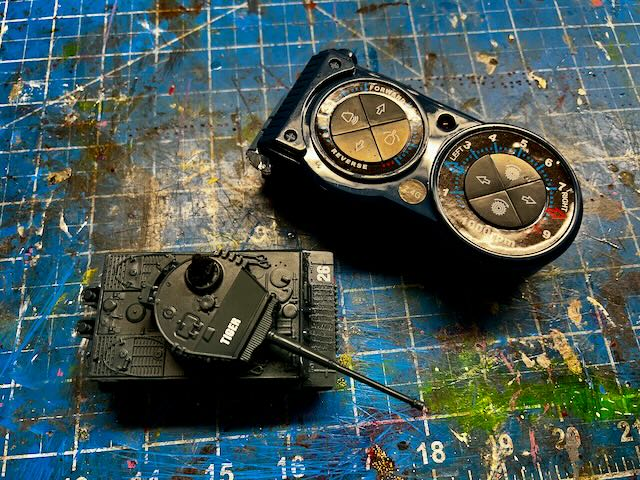
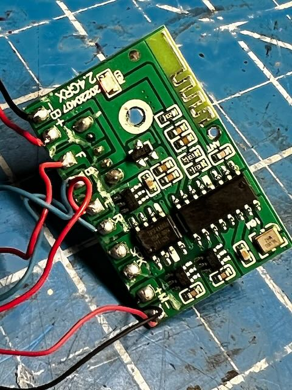
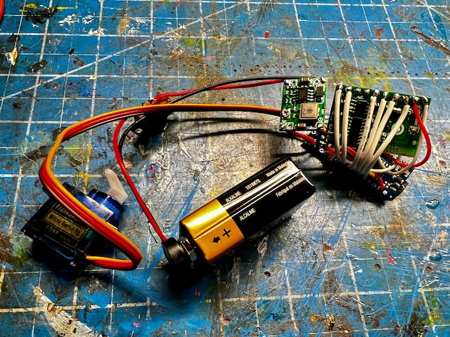
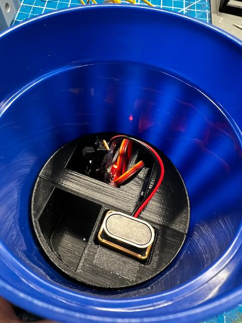

# Tipping Cup

Prop design by Dustin Grau

Originally created for use in Matilda the Musical, this device can also be used as a "possessed item" which will randomly move on its own.

## Operation

There are 2 primary modes for operation: wobbling and tipping. In the wobble mode, the servo will randomly move a short distance to make the prop tilt, return to normal, then wait a random time before repeating. In the tipping mode the servo will go through a full 180&deg; movement to cause the cup to tip over.

## Parts

* [SG90 9g Micro Servo](https://a.co/d/7Wwkuhb) - This is a good balance between size and torque needed
* [Arduino Nano](https://a.co/d/5m9NQ1E) - We need a controller which can take inputs and use PWM control
* [2.4GHz RC Remote](https://a.co/d/b6ze1Bv) - Any micro remote transmitter/receiver is viable for use
* [DC Buck Converter](https://a.co/d/8IMmLeA) - Needed to bring the 9V power source down to 5V
* [9V Battery Connector](https://a.co/d/fDPGKFS) - Easy connector to a standard 9V battery
* Plastic Cup - Ideally no more than 6" tall, designed around a 84mm/3.3" base

## Models

See the "stl" folder for the necessary brackets and components for housing the electronics. The main bracket is a 2-part design which can be screwed together using M3 screws. The servo foot can be attached with a small length of metal such as a bent paperclip.

## Assembly

From the remote controlled tank the only components you truly need are the transmitter (handheld remote) and the radio receiver (green PCB) from inside the tank.

The motors, speaker, and battery connections will be cut away, leaving only the PCB. **Just be careful when cutting away the battery as you don't want to short the positive and negative wires together!**

For power I used a 9V battery due to its availability and ability to provide enough current to the servo. This is connected to the buck converter which is set to 5V for output, which is what's expected by the Arduino and receiver. Note that it is a good idea to put a switch on the positive wire so you can easily turn off the device--leaving it on will cause the radio receiver to drain the battery.

`9V Battery --> Switch (positive) --> Buck Converter + (Input)`
`9V Battery --> Ground (negative) --> Buck Converter - (Input)`

The output of the buck converter is split to the Arduino and Servo motor to power both devices at the same time.

`Buck Converter (Output) --> Arduino Nano (VIN/GND) and Red/Brown on Servo`

For the Arduino Nano these are the pins used for power and the radio receiver:

- `VIN` to Buck output (+)
- `GND` to Buck output (-)
- `A1` to PCB `F`
- `A2` to PCB `B`
- `A3` to PCB `L`
- `A4` to PCB `R`
- `A5` to PCB `M+`
- `A6` to PCB `M-`
- `GND` to Receiver B (-)
- `3v3` to Receiver B (+)

For the Servo these are the connections needed to the Arduino Nano:

- Red (Power) to Buck output (+)
- Yellow (Data) to `D9` on Arduino Nano
- Brown (Ground) to Buck output (-)

Once the firmware is uploaded to the microcontroller, you will be able to control the servo using the remote control. The idea is that the servo will push on the "foot" to move the cup in the opposite direction. The software may need to be tuned depending on the size and weight of the cup used, adjusting the angle and range of motion.

Once placed within the printed housing, the device can reside inside the cup. Note that this was built around a specific plastic cup but the models can be altered as necessary if you have the skills. I use TinkerCAD for a lot of my projects which is free and easy to use.

